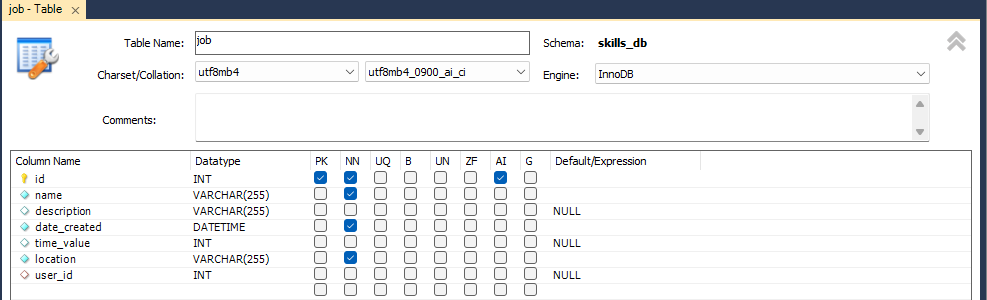
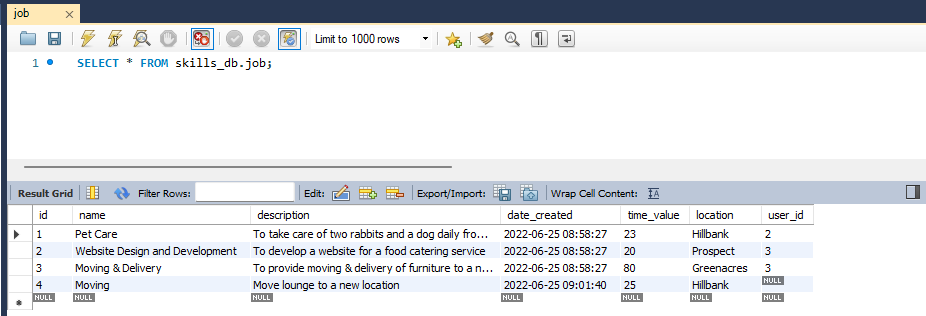
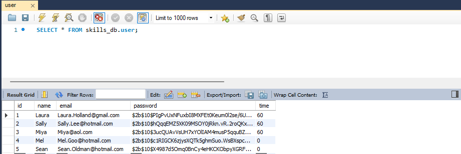
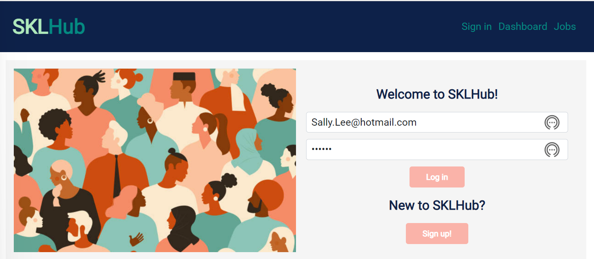
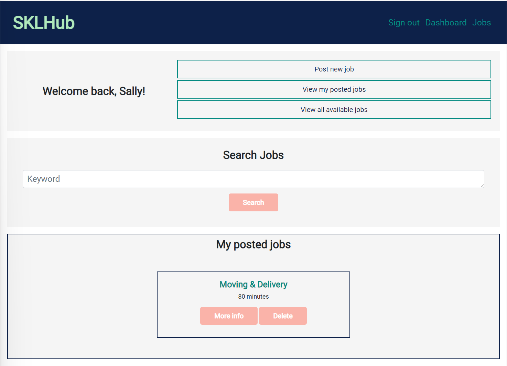
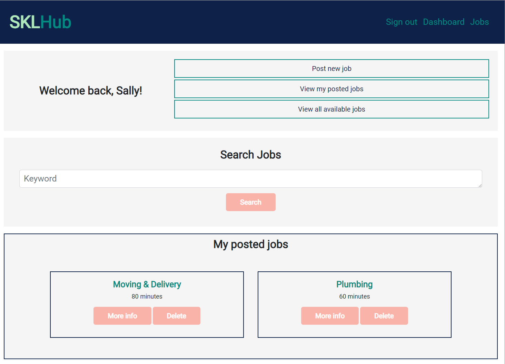
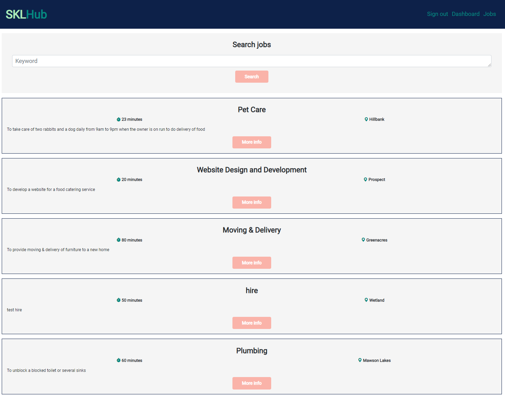
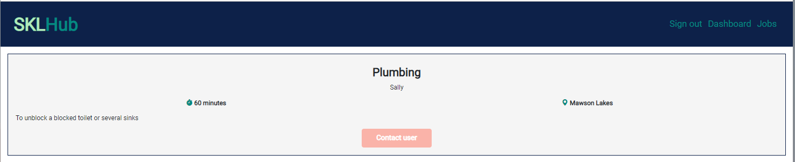

## Group Project 2 : SKLHub

This project is to build an application encouraging the users to revert to the old way of doing things.  Before money was introduced, people traded their skills and talents through a bartering system.  In this way, everyone got what they want or meet their needs, coming up with fair trades and putting their education and professional abilities to good use.

Our application will facilitate money-free bartering system if possible or little money is needed, making it simple or find services they need and to offer their skills and talents to others.  At the same time, to foster friendships in the neighbourhood.  Whatever need you have, we aim to fill it with this application and the target will be the new college graduates, established professionals, entrepreneurs, tradesperson and people from all walks of life.

This application will follow the MVC paradigm in its architectural structure, using Handlebars.js as the templating language, sequelize as the ORM, and the express-session npm package for authenication.

The URL of the GitHub repository is <strong>https://github.com/sarahgormley/sklhub.git</strong> and the repository name is sklhub.

## Table of Contents

* [Contributors](#contributors)
* [Installation](#installation)
* [Usage](#usage)
* [References](#references)
* [License](#license)

## Contributors

Project Team Group 2 Contributors are:-

* Orcun Sarmis - Controllers and MVC Folder
* Charlotte Dige - Views/Handlebars/CSS
* Sarah Gormley - Front-end JS and Wireframing
* Stella Ling - Models, Seeds and README

## Installation

* This application follows the Model-View-Controller paradigm.  The Model-View-Controller(MVC) is an architectural pattern that adheres to the separation of concerns principle. 

   - The Model - stores data and data-related logic,
   - The View - the UI/UX concerns, or what a user will see and interact,
   - The Controller - the interface between Models and Views.  It processes the requests from the View, uses the Model to manipulate data and sends data to the View to render.

* This application will need the installation of Node.js and Express.js to create a RESTful API, Handlebars.js as the template engine and use MySQL and the Sequelize ORM as the database.

* Node Package Manager (npm) is a software manager and installer which puts the modules in place so that node project can utilize it, and also, it manages dependency conflicts intelligently and initialized using <strong>npm init</strong>.  The package.json will be generated and will contain all the details of the application in which the user have inputted during the npm initialization.

* The npm packages in use for this project:-

  - npm express.js (npm i express)
  - npm handlebars.js (npm i handlebars)
  - npm sequelize ORM (npm i sequelize)
  - npm express-Session (npm i express-session)
  - npm bcrypt (npm i bcrypt)
  - npm mysql2 (npm install --save mysql2)
  - npm dotenv (npm install dotenv --save)
  - npm nodemon (npm i -D nodemon)
  - npm connect-session-sequelize (npm i connect-session-sequelize)
  - npm cookies (npm i cookies)
  - npm router (npm i router)
  - npm bootstrap 5.0.2  
  - npm email-validator (npm i email-validator)

 * npm email-validator provides a fast, pretty robust e-mail validator which checks form and not function and not discussed in the class.This project uses email address as primary form of contact and thus of a great importance to install this package.    

 * npm bootstrap 5.0.2 also another new library not discussed in the class.

 * Nodemon is installed as development dependency meaning that if our application ever goes into production, this package will not be included. The purpose of this package is to watch for any changes in our files and restart the server instead of us having to do that manually ourselves. 

* The database models are set up in accordance to the criteria for this application.  See the screenshots from MySQL WorkBench. MySQL Workbench is installed to help with design, create and browse the database schemas, work with the database objects and insert data as well as design and run SQL queries to work with the stored data.

* The link to install this is provided out of the office hours and not used in class practices and this is one other technology not instructed to use or discussed in detail.

* Below shows MySQL Workbench for the database, skills_db:-

    
    
    
    

* The test of the application is done locally before deployment to Heroku using Insomnia.  At the comand prompt, type in npm start or nodemon server.js or at localhost:3001

  

* Test locally using Insomnia:-

   

## Usage

The steps to show on how the user could use the SKLHub site:-

* When the user visit the SKLHub site, the user will be presented with "Welcome to SKLHub!" which the user can log in if they have an account with SKLHub or Sign Up if they don't have an account with SKLHub.  

  

* At the Sign Up page, the new user can sign up by entering their username, email address and password:-

    

* Once the user log in, this will bring the user to the dashboard where the user can post new jobs:-

  

* Once the user has entered the job details and click on "Post job!", this will be displayed on the dashboard.

  

* The user would be able to view all the available jobs by clicking on the "Jobs"on the navigation bar or "View all available jobs".

  

* Once the user click on "More Info" on Jobs, the users (the community) will able to view the details and contact each other by email.

  
  
  

* Clicking on "Sign Out" will bring the user to the "Welcome" page.

  

## References

* The Unit Ahead Materials: Model-View-Controller (MVC)
* Unit 14: Student Mini Project - Crowdfunding App
* Request - Response: The Full-Stack Blog : Heroku Deployment Guide

## License

This project is licensed under the terms of the MIT license.
